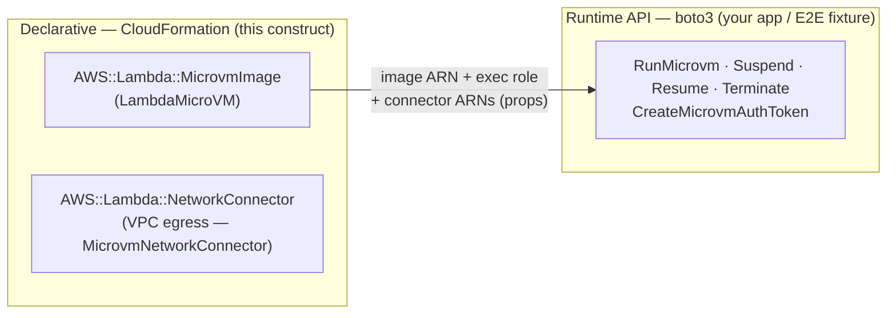
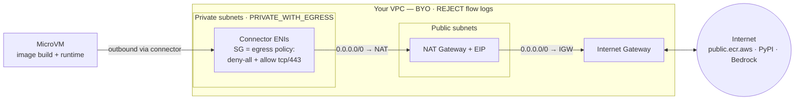
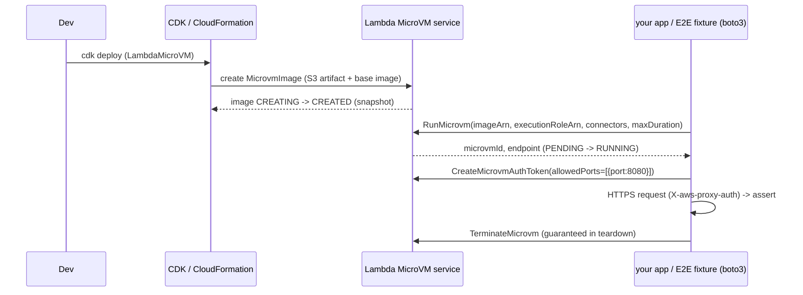

# AWS Lambda MicroVM CDK Construct (Python)

[](https://github.com/ran-isenberg/lambda-microvm-cdk-python/blob/main/LICENSE)


<a href="https://ranthebuilder.cloud/"></a>

A reusable **AWS CDK v2 construct (pure Python, 3.11+)** for provisioning
[AWS Lambda MicroVMs](https://docs.aws.amazon.com/lambda/latest/dg/lambda-microvms-guide.html) —
Firecracker-based, VM-isolated, snapshot-fast serverless compute for AI sandboxes, interactive dev
environments, and multi-tenant CI. Secure defaults, every AWS knob overridable, plus an escape hatch.

**[📜 Documentation](https://ran-isenberg.github.io/lambda-microvm-cdk-python/)** | **[Blogs website](https://ranthebuilder.cloud/)**
> **Contact details | mailto:<ran.isenberg@ranthebuilder.cloud>**

[](https://twitter.com/RanBuilder)
[](https://ranthebuilder.cloud/)

> **Status:** early development (targets a preview AWS API).
> Repo: `lambda-microvm-cdk-python` · [PyPI: `lambda-microvm-cdk`](https://pypi.org/project/lambda-microvm-cdk/).

## What it does

`LambdaMicroVM` is a typed wrapper around the L1 `AWS::Lambda::MicrovmImage` resource. In one
construct it zips your `Dockerfile`+app, uploads it to S3, creates least-privilege **build** and
**VM-execution** roles, resolves the managed base-image version, and emits a snapshotted MicroVM
image — with secure defaults and an `overrides` escape hatch for anything not yet modeled.

*Running* a MicroVM (run / suspend / resume / terminate) is a **runtime API call**, not
CloudFormation — so it's driven with **boto3** from your app or the E2E fixture, using the
construct's typed properties (image ARN, execution role, connector ARNs, log group). There is no
launcher Lambda / API Gateway / WAF — you call the runtime API directly.

### Two planes



Images and connectors are declarative CDK; the *running* instance is runtime-only, wired from the
construct's outputs.

## Quickstart

### Install

Add the package to your CDK app (Python 3.11+). `aws-cdk-lib`, `constructs`, and the
`aws-cdk-aws-ec2-alpha` module (used by the VPC-egress construct) are pulled in as dependencies.

```bash
pip install lambda-microvm-cdk
# or
uv add lambda-microvm-cdk
# or
poetry add lambda-microvm-cdk
```

### Use

```python
from aws_cdk import Stack
from lambda_microvm_cdk import LambdaMicroVM

class MyStack(Stack):
    def __init__(self, scope, id, **kw):
        super().__init__(scope, id, **kw)

        vm = LambdaMicroVM(self, "Agent",
            source="microvm_app",                 # dir with a Dockerfile (also: .zip path or s3_assets.Asset)
            description="headless agent VM",
            memory_mib=2048,                       # tier: 512|1024|2048|4096|8192
            environment={"LOG_LEVEL": "info"},     # NEVER secrets — baked into the snapshot
            # architecture defaults to ARM_64 (only value the service accepts today)
            # enable_logging=True, os_capabilities=[], overrides={} ...
        )

        vm.image_arn          # Fn::GetAtt ImageArn (token)
        vm.execution_role     # least-priv VM execution role (add workload perms on top)
        vm.grant_run(caller)  # attach least-priv RunMicrovm* to a runtime-caller principal
```

### Custom VPC egress (optional)

Route the VM's outbound traffic through **your VPC** with `MicrovmNetworkConnector`. It's **BYO-VPC** —
you own the VPC (and whether it has internet egress). Pass the connector straight to
`egress_connectors=[...]`; the security group's rules **are** the egress policy (deny-all by default).



The **security group** is the only egress gate (deny-all + explicit allows, stateful); the **NAT gateway
has no rules** — it just gives the private subnets a path to the internet. Full architecture +
fully-private (no-NAT) option: **[Custom Egress docs](https://ran-isenberg.github.io/lambda-microvm-cdk-python/custom_egress/)**.

> **Build-time vs run-time egress.** `egress_connectors` is the **image build's** egress — the build
> runs your `Dockerfile` in a MicroVM, so the VPC must reach your base image + package repos (a **NAT
> gateway**, or private mirrors). A locked-down VPC with no route to those fails the build. For VPC egress
> only at *runtime*, leave `egress_connectors` empty and pass the connector to `run_microvm` instead.

```python
import aws_cdk.aws_ec2 as ec2
from lambda_microvm_cdk import LambdaMicroVM, MicrovmNetworkConnector

# BYO VPC with a NAT gateway so the image build can reach public.ecr.aws + PyPI.
vpc = ec2.Vpc(self, "Vpc", max_azs=2, nat_gateways=1)  # or an aws_ec2_alpha.VpcV2 — see sample/

connector = MicrovmNetworkConnector(
    self,
    "Egress",
    vpc=vpc,  # deny-all egress SG by default
)
connector.security_group.add_egress_rule(
    ec2.Peer.any_ipv4(),
    ec2.Port.tcp(443),
    "HTTPS egress",
)
vm = LambdaMicroVM(
    self,
    "Agent",
    source="microvm_app",
    egress_connectors=[connector],  # accepts the connector object or a raw ARN string
)
```

See [`sample/sample_stack.py`](sample/sample_stack.py) for a full `VpcV2` + NAT-gateway example.

### Build & run flow



## Sample app

[`sample/`](sample/) is a deployable CDK app whose MicroVM runs a model worker on **Amazon Bedrock
(us-east-1)** — **Amazon Nova 2 Lite by default** (boto3 Converse), with **Claude Opus 4.8 opt-in**
(`MODEL_PROVIDER=anthropic`). The worker is tiered so the deterministic gate never depends on the model.
The E2E suite runs **two tests** against one VM:

1. **`echo`** — deterministic, no model. **The E2E gate.**
2. **`bedrock`** — one model call (Nova default / Opus opt-in); the E2E test asks the model to sum two
   random numbers and asserts the reply contains the sum.
3. **`agent`** — Claude Code headless (opt-in enhancement, not exercised by the E2E tests).

## Local development

For working on the construct itself (not just consuming it). Uses [uv](https://docs.astral.sh/uv/),
[ruff](https://docs.astral.sh/ruff/), and the AWS CDK CLI via `npx` (see the [Makefile](Makefile)).

```bash
make dev        # uv sync (venv + dev deps)
make lint       # ruff format --check + ruff check + mypy
make unit       # unit tests (no AWS; boto3 mocked)
make synth      # npx aws-cdk synth the sample app (runs cdk-nag)
```

CI/CD and the docs pipeline are described in [docs/pipeline.md](docs/pipeline.md).

## Code contributions

Contributions are welcome — please open an issue or PR. PR titles follow the
`feature | fix | docs | chore` convention (validated in CI).

## Connect

- Website: [www.ranthebuilder.cloud](https://www.ranthebuilder.cloud/)
- Blog: [ranthebuilder.cloud/blog](https://www.ranthebuilder.cloud/blog)
- X (Twitter): [@RanBuilder](https://twitter.com/RanBuilder)
- Email: [ran.isenberg@ranthebuilder.cloud](mailto:ran.isenberg@ranthebuilder.cloud)

## License

This library is licensed under the **MIT-0** License. See the [LICENSE](LICENSE) file.
