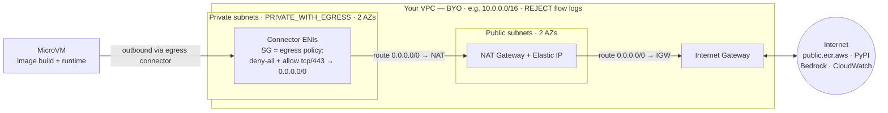

# Network connector — `MicrovmNetworkConnector`

By default a Lambda MicroVM has **public internet egress**. To route its outbound traffic through
**your own VPC** — to reach RDS, ElastiCache, internal APIs, on-prem over Direct Connect/VPN, or just
to control egress — use **`MicrovmNetworkConnector`** (`AWS::Lambda::NetworkConnector`, egress-only).

The construct is **BYO-VPC**: you own the VPC and its topology (crucially, whether it has internet
egress). The construct adds the connector, a security group whose rules **are** the egress policy, and
a least-privilege ENI operator role. Feed it to the image with `LambdaMicroVM(egress_connectors=[...])`.

## Inputs

| Prop | Type | Default | Notes |
|------|------|---------|-------|
| `vpc` | `ec2.IVpc` | — | **required** — the VPC the ENIs attach to (`VpcV2` or classic `ec2.Vpc`) |
| `vpc_subnets` | `ec2.SubnetSelection \| None` | `PRIVATE_WITH_EGRESS` | where the ENIs are placed (1–16 subnets) |
| `security_group` | `ec2.ISecurityGroup \| None` | created | its rules **are** the egress policy |
| `allow_all_outbound` | `bool` | `False` | egress posture of the *created* SG (deny-all by default) |
| `network_protocol` | `"IPv4" \| "DualStack"` | `"IPv4"` | IPv4-only or dual-stack |
| `operator_role` | `iam.IRole \| None` | created | role Lambda assumes to create the ENIs |
| `name` | `str \| None` | derived (stable) | `^[a-zA-Z0-9-_]+$`, 1–64 |
| `removal_policy` | `RemovalPolicy` | `DESTROY` | |
| `tags` | `dict[str, str] \| None` | `{}` | cost-allocation friendly |
| `overrides` | `dict[str, Any] \| None` | `{}` | merged verbatim into the L1 `Properties` |

## Properties

- **`connector_arn`** — `Fn::GetAtt Arn`; pass to `LambdaMicroVM(egress_connectors=[...])` or `run_microvm`.
- **`state`** — `Fn::GetAtt State` (deploy-time token).
- **`connector_name`** — the resolved connector `Name` (stable across synths).
- **`vpc`** — the (BYO) VPC the ENIs attach to.
- **`subnets`** — the subnets the ENIs live in (e.g. to place VPC endpoints alongside them).
- **`security_group`** — the connector SG; define egress with `add_egress_rule(ec2.Peer…, ec2.Port…)`.
- **`operator_role`** — the ENI-management role actually used (created least-privilege unless supplied).

There are no public methods — egress is defined by adding rules to `security_group`.

## Network architecture sample



**Traffic path.** The MicroVM's outbound packets leave through the connector's **elastic network
interfaces (ENIs)**, which live in the VPC's **private** subnets. Each ENI carries the connector's
**security group** — the actual egress gate (deny-all by default; here it allows `tcp/443` to the
internet). Allowed traffic follows the private subnet's route (`0.0.0.0/0 → NAT`), the NAT gateway sits
in a **public** subnet and forwards it (`0.0.0.0/0 → Internet Gateway`) to the internet. The SG is
stateful, so return traffic comes back automatically.

**Control plane (CloudFormation).** `MicrovmNetworkConnector` emits the `AWS::Lambda::NetworkConnector`
with `VpcEgressConfiguration` = your private `subnet_ids` + the `security_group_id`; the **operator
role** is what Lambda assumes to create those ENIs. You wire it to the image with
`LambdaMicroVM(egress_connectors=[connector])`.

## Build-time vs run-time egress (important)

`LambdaMicroVM(egress_connectors=…)` is the **image build's** egress — the build runs your `Dockerfile`
inside a MicroVM using that connector. So the VPC must reach whatever the build downloads:

- base image from `public.ecr.aws` (ECR Public) — HTTPS
- packages from PyPI / your package repo — HTTPS
- build logs to CloudWatch — HTTPS

None of those have a clean private VPC endpoint, so a VPC with **no route to the internet fails the
build**. Two ways to satisfy it:

1. **NAT gateway** (what the sample does) — open `443` egress and let the private subnets reach the
   internet via NAT. Simplest; covers build + runtime + Bedrock.
2. **Fully private** — no NAT: a private ECR (or pull-through cache) for the base image, CodeArtifact
   for pip, plus S3-gateway + interface endpoints (`ecr.api`, `ecr.dkr`, `codeartifact.*`, `logs`,
   `bedrock-runtime`). More setup; requires Dockerfile changes.

Build-time and run-time connectors **can differ**. If you only need VPC egress at *runtime*, leave
`egress_connectors` empty (the build uses default internet egress) and pass the connector per-launch to
`run_microvm` instead.

## Example (VpcV2 + NAT)

!!! tip "This mirrors the deployed sample"
    The snippet below is a condensed, self-contained version of what the sample actually deploys and
    passes E2E against — the source of truth is
    [`sample/sample_stack.py`](https://github.com/ran-isenberg/lambda-microvm-cdk-python/blob/main/sample/sample_stack.py)
    (`_build_egress_vpc` builds the VPC + NAT, `_build_vpc_egress` builds the connector). Prefer copying
    from there so you can't drift from tested code.

```python
import aws_cdk.aws_ec2 as ec2
from aws_cdk.aws_ec2_alpha import IpAddresses, IpCidr, NatConnectivityType, Route, RouteTargetType, SubnetV2, VpcV2
from lambda_microvm_cdk import LambdaMicroVM, MicrovmNetworkConnector

# 1. BYO VPC with a NAT gateway (a classic ec2.Vpc(max_azs=2, nat_gateways=1) works too).
vpc = VpcV2(
    self,
    "EgressVpc",
    primary_address_block=IpAddresses.ipv4("10.0.0.0/16", cidr_block_name="Primary"),
    enable_dns_hostnames=True,  # resolve public.ecr.aws / PyPI during the build
    enable_dns_support=True,
)
azs = self.availability_zones[:2]
public = [
    SubnetV2(
        self,
        f"Public{i}",
        vpc=vpc,
        availability_zone=az,
        ipv4_cidr_block=IpCidr(f"10.0.{i}.0/24"),
        subnet_type=ec2.SubnetType.PUBLIC,
    )
    for i, az in enumerate(azs)
]
private = [
    SubnetV2(
        self,
        f"Private{i}",
        vpc=vpc,
        availability_zone=az,
        ipv4_cidr_block=IpCidr(f"10.0.{i + 10}.0/24"),
        subnet_type=ec2.SubnetType.PRIVATE_WITH_EGRESS,
    )
    for i, az in enumerate(azs)
]
vpc.add_internet_gateway(subnets=[ec2.SubnetSelection(subnets=public)])
nat = vpc.add_nat_gateway(subnet=public[0], connectivity_type=NatConnectivityType.PUBLIC)
for i, subnet in enumerate(private):
    Route(
        self,
        f"PrivateEgressRoute{i}",
        route_table=subnet.route_table,
        destination="0.0.0.0/0",
        target=RouteTargetType(gateway=nat),
    )

# 2. Connector on the private subnets; the SG is the egress policy (deny-all by default).
connector = MicrovmNetworkConnector(
    self,
    "Egress",
    vpc=vpc,
    vpc_subnets=ec2.SubnetSelection(subnets=private),
)
connector.security_group.add_egress_rule(
    ec2.Peer.any_ipv4(),
    ec2.Port.tcp(443),
    "HTTPS egress for build + Bedrock",
)

# 3. Bake it into the image (accepts the connector object or a raw ARN).
vm = LambdaMicroVM(
    self,
    "Agent",
    source="microvm_app",
    egress_connectors=[connector],
)
```

!!! note "High availability"
    The sample provisions **one** NAT gateway (cost). Both private subnets route to it, so an AZ
    outage where the NAT lives would drop egress for the other AZ. For production HA, use one NAT
    gateway per AZ.

The full, deployable version is in [`sample/sample_stack.py`](https://github.com/ran-isenberg/lambda-microvm-cdk-python/blob/main/sample/sample_stack.py).
