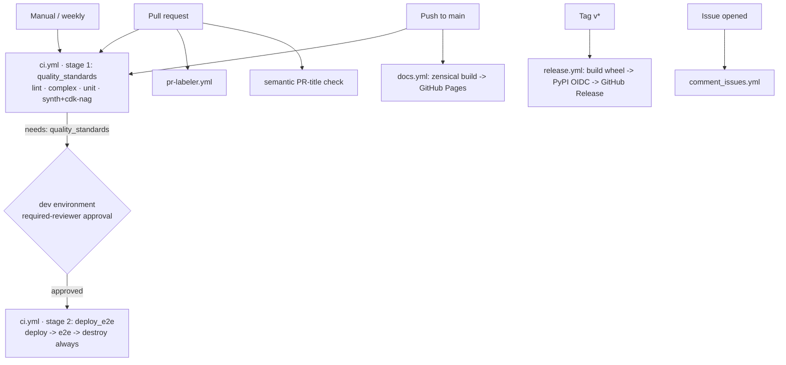

# Pipeline

Everything is driven through the [`Makefile`](https://github.com/ran-isenberg/lambda-microvm-cdk-python/blob/main/Makefile)
(uv + ruff + mypy + cdk-nag). The GitHub Actions workflows call the **same targets**, so local and
CI behave identically. The AWS CDK CLI is invoked via `npx aws-cdk` — no global install needed.

## Make targets

| Target | Purpose |
|--------|---------|
| `dev` | `uv sync` — create the venv and install dev deps |
| `lint` | `ruff format --check` + `ruff check` + `mypy --strict` |
| `format` | auto-fix lint + format |
| `complex` | radon / xenon complexity gate |
| `unit` | unit tests + coverage (no AWS; boto3 mocked) |
| `synth` | `npx aws-cdk synth` the sample app (runs cdk-nag) |
| `deploy` / `destroy` | `npx aws-cdk deploy --require-approval never` / `destroy --force` |
| `e2e` | deploy-backed E2E: launch a VM, prompt, assert, terminate in teardown |
| `package` | `uv build` — sdist + wheel |
| `docs` / `publish-docs` | `zensical serve` / `zensical build` |
| `pr` | pre-merge gate: `format + lint + complexity + unit + synth` |

## Workflows

- **`ci.yml`** is a two-stage pipeline, on PR / push to `main` / manual / weekly:
  - **Stage 1 — `quality_standards`.** Lint, complexity, unit tests and `cdk synth` (which runs
    cdk-nag `AwsSolutionsChecks`). **No AWS credentials** — the base-image lookup falls back to
    `"0"` and boto3 is mocked. This is the default merge gate.
  - **Stage 2 — `deploy_e2e`** (`needs: quality_standards`). Gated real-AWS stage: assumes an AWS
    role via **OIDC**, then `deploy → e2e → destroy`, with `destroy` in an `if: always()` step so
    the account is left clean even on failure. It runs **only after stage 1 passes and only once
    approved** through the `dev` environment's **required reviewers** — until then it pauses and the
    `AWS_ROLE_ARN` (a `dev` environment secret) is not exposed. Approve only after reviewing the
    diff, since the approved run executes the PR's code against the AWS account.
- **`docs.yml`** — builds the zensical site and deploys it to **GitHub Pages** on push to `main`.
- **`release.yml`** — on a `v*` tag: `make package` → publish to **PyPI via Trusted Publishing
  (OIDC, no token)** → cut a GitHub Release with generated notes.

### Release (tag → PyPI)

Publishing uses PyPI **Trusted Publishing** (OIDC), so no long-lived API token is stored. To cut a
release: bump `version` in `pyproject.toml`, tag `vX.Y.Z`, and push the tag. Configure the PyPI
project's trusted publisher to this repo's `release.yml` / `pypi` environment beforehand.

## Community automation

- **`pr-labeler.yml`** labels PRs from their commit prefixes (`feature`→enhancement, `fix`→bug,
  `docs`→documentation, `chore`→chore, `!`→breaking-change).
- **`semantic.yml`** validates the PR title against the repo's commit convention.
- **`comment_issues.yml`** auto-acknowledges newly opened issues.
- **`dependabot.yml`** keeps GitHub Actions and pip dependencies current (monthly, `chore:` prefix).
- **`release.yml`** (config) groups auto-generated release notes by label.
